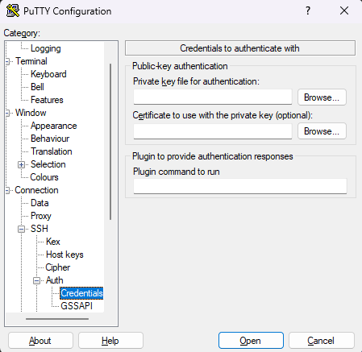

# Experiment 3 : EC2

***Software*** : AWS Academy Account

***Objective*** : To deploy static website on an EC2 instance. 

***Requirements*** : Each student must develop their own portfolio website with minimum two pages. Landing page must have the name of the student along with their photo and other details that will look good in a portfolio website. Another page must have a list of all the skills known to the student.

***Sample App*** : Sample app for reference DONOT use it every student must make their own portfolio website.

[https://github.com/shiburaj/my-portfolio-static](https://github.com/shiburaj/my-portfolio-static)

## Steps to Start AWS Academy Lab
1. Go to AWS Academy Website [Click Here](https://awsacademy.instructure.com/login/canvas)
2. Login with your AWS Academy Credentials or use Forgot Password if you cant remember your password.
3. Go to the Cloud Foundations Course
4. Click Modules and scroll down to Sandbox
5. After opening sandbox click the button to open sandbox in a new window.
6. Click the `Start Lab` button to start the Lab.
7. After sometime when the lab starts the timer of 3hrs will start.
8. Click the `AWS` button to go to your AWS Dashboard.

## ***Steps to Deploy*** :
1. Go to Services >> Compute >> EC2
2. Create a Key Pair
   - Go to `Network & Security` >> `Key Pairs`
   - Click `Create Key Pair` button
   - Give an appropriate key name
   - Key pair type RSA
   - Format `.ppk`
   - Add tags if required
   - Click `Create key Pair` button
   - Download the key pair file and save it in a safe location
   


3. Create a Security Group
   - Go to `Network & Security` >> `Security Groups`
   - Click `Create Security Group` button
   - Give an appropriate security group name
   - Give a appropriate description
   - Select the VPC on which the security group will be applied
   - Add the necessary Inbound rules as per the need of the app. (SSH is required to connect to linux machine, Other ports as per requirement of the app)
   - Add tags if required
   - Click `Create Security Group` button


4. Create Instance
   - Got to `Instances` >> `Instances`
   - Click `Launch Instances` button
   - Give a name to the Instance
   - Select OS. (Ubuntu)
   - Select Instance Type (t2.micro)
   - Select the created key pair from the dropdown
   - Select the security group that you have created from the dropdown 
   - Configure storage (8gb is fine)
   - Click Launch Instance button 
5. Assign Elastic IP to the Instance
   - Go to Networking & Security >> Elastic IPs
   - Click Allocate Elastic IP Address button
   - Add tags if required
   - Click Allocate button
   - Select the new IP address and go to Actions >> Associate Elastic IP Address
   - Select Resource Type as Instance
   -   Select your instance from dropdown
   -   Select the private ip address from the dropdown
   -   Enable Reassociation
   -   Click Associate button


6. Connect to the Instance using Putty
   -  Under the Hostname put the Elastic IP of the server
   -  Port will be `22`
   -  Under `Connection` >> `SSH` >> `Auth` >> `Credentials` browse the private key downloaded in Step 2
   -  Click the Open button
   -  When connection for the first time there may be a Firewall exception pop up Accept it.




7. Setup the environment for your app on the machine
```
sudo apt update
sudo apt install nginx git -y
sudo service nginx status
cd /var/www/html
sudo rm any-file.html
sudo git clone https://github.com/your-github-portfolio-repo .
```
   - Run apt update to update the package list
   - Install the nginx server and git if required
   - Check if nginx server is running
   - Go to `/var/www/html` directory where we have to upload our website.
   - Remove any file inside this folder as we have to start fresh
   - Clone your portfolio website to this folder.
8. Open the website in a new tab using the elastic ip
```
http://<elastic-ip-address>
```
## After Taking Screenshots of EC2 Instance Dashboard and Your Website Stutdown Instance
9. Shutdown All Services after using
   - Disassociate Elastic IP
   - Release Elastic IP
   - Terminate Instance
   - Delete Security Group
   - Delete Key Pair  