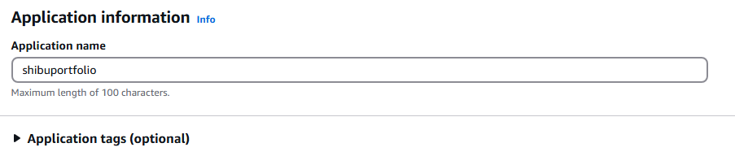

# Experiment 4 : EB

***Software*** : AWS Academy Account

***Objective*** : To deploy an ExpressJS app on an Elastic Beanstalk. 

***Requirements*** : Each student must develop their own portfolio website with minimum two pages. Landing page must have the name of the student along with their photo and other details that will look good in a portfolio website. Another page must have a list of all the skills known to the student.

***Sample App*** : Sample app for reference DONOT use it every student must make their own portfolio website.

[https://github.com/shiburaj/my-portfolio-express](https://github.com/shiburaj/my-portfolio-express)

***Preparations*** : Download the code from github in zip format. Extract it in a folder of your choice. Get into the folder and check it one of the following is present in the package.json file.

```
"main": "app.js",

```
or
```
"scripts": {
    "start": "node app.js"
},

```
It is assumed that `app.js` is the entry file. Change it as per your code. Once these changes are done select all the files and create a zip file. DONOT create the zip of the folder.

## ***Steps to Deploy*** :
1. Go to Services >> Compute >> Elastic Beanstalk
2. Click Create Application button
3. Step 1 : Configure Environment
   - Environment Tier : Web server environment

   - Give appropriate application name and tags if required

   - Environment Info: Name will be auto-populated, select an appropriate unique domain name, Any description if required

   - Platform: Choose as per your app

   - Application code: Upload the code zipped in the preperation step

   - Presets : Single Instance


4. Step 2 : Configure Service Access : Select LabRole, vockey, LabInstanceProfile

5. Step 3 : Networking : Select appropriate VPC and subnets. Since the app doesnt require database you can skip database section.

6. Step 4 : Traffic and Scaling : Select the default security group or you may create a seperate security group and select it. Auto scaling may be configured if required.
7. Step 5 : Monitoring : No change in monitoring
8. Step 6 : Review and Launch

9.  After step 6 wait for the deployment to be complete. Then Open the website in a new tab using the domain provided by EB and port address 
```
http://<elastic-beanstalk-domain-address>:<port-number>
```
If the website is not opening then check if the security group is configured for the port.