# Experiment 6 : RDS

***Software*** : AWS Academy

***Objective*** : To deploy an ExpressJS Notes app on AWS RDS. 

***Requirements*** : Each student must deploy Express Notes app on AWS RDS. 

***Sample App*** : Sample app for reference DONOT use it directly. Every student should **fork** this repo to your account and make changes and commit it to the repo. The changes needs to be done in the `views/index.njk` file. Name should be updated.

[https://github.com/shiburaj/my-notes-express](https://github.com/shiburaj/my-notes-express)

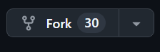

## ***Steps to Deploy*** :
1. Go to Services >> Compute >> EC2
2. Follow `Exp 3` guide to host the code in your repo to the EC2 instance
3. Go to Services >> Database >> Aurora & RDS
4. From the sidebar Goto Databases
5. Click `Create Database` button 
6. Choose a database creation method: **Standard create**

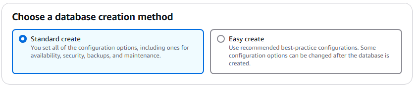

7. Engine : **Mysql**, Select the required version of Mysql too.

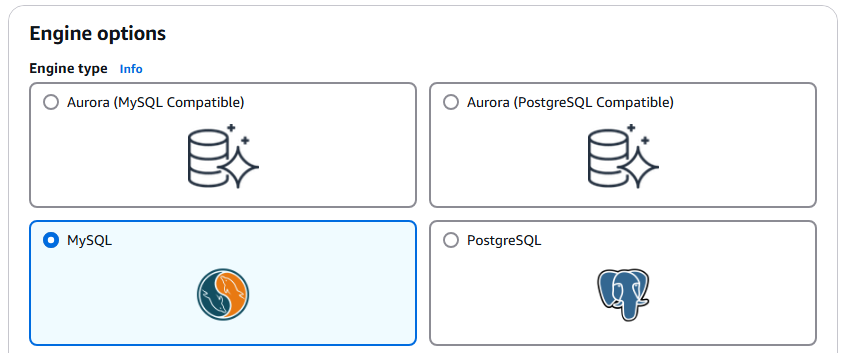

8. Templates: **Free tier**

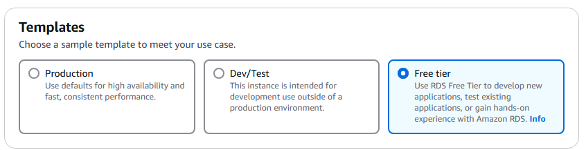

9. Availability and durability : **Single-AZ**

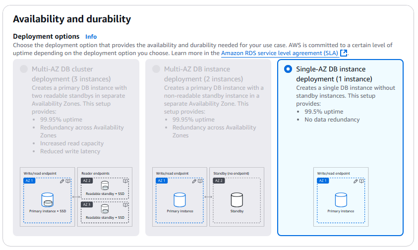

10. Settings: Give a db identifier, master username and password.

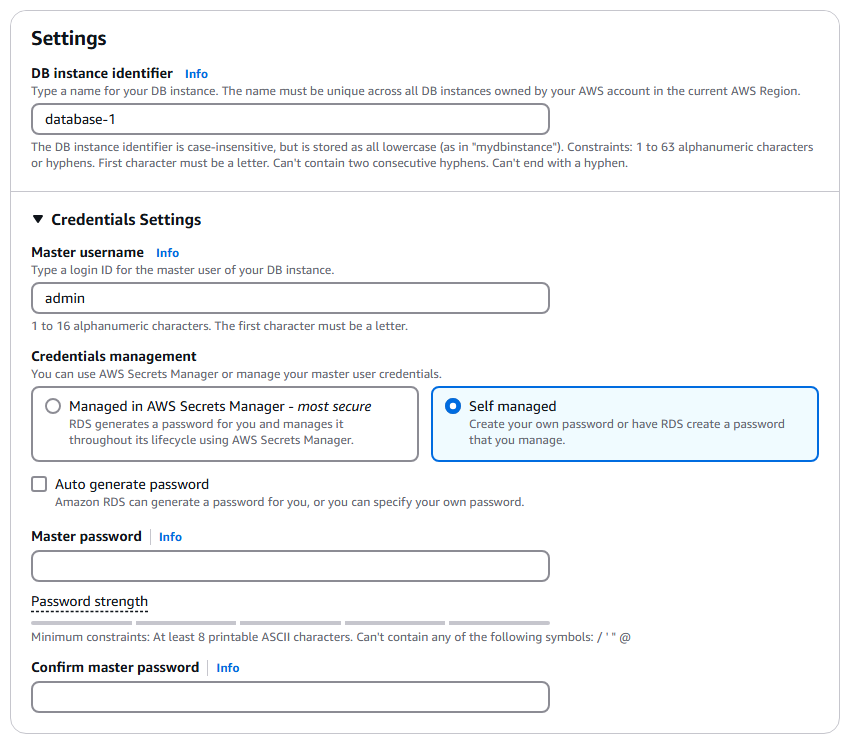

11. Instance configuration: Select Instance class `db.t4g.micro`

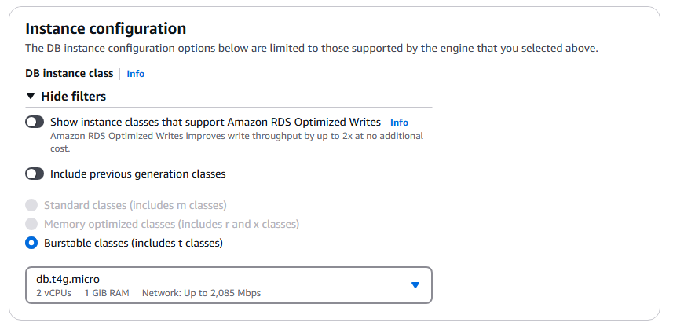

12. Storage: Select storage type

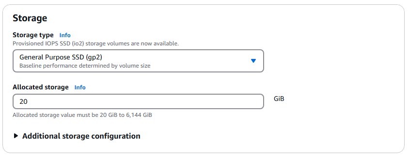

13. Connectivity: Connect to EC2. Very important to do this step to allow the EC2 app to communicate with RDS.

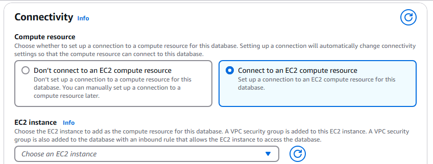

14. Select the Security Group created during EC2

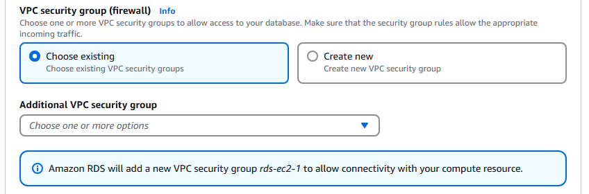

15. Tags : Add necessary tags if required


16. Database Authentication : **Password**

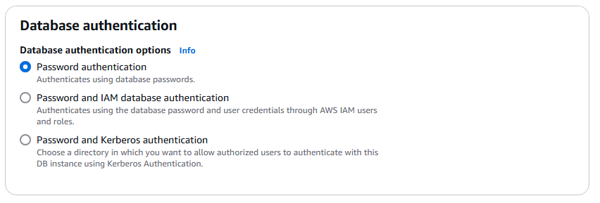

17. Click `Create Database` Button to create DB Instance

18. Go to EC2 and open the Static IP in a new browser with your app port and test the app.
```
http://<ec2-static-ip>:<port>
```